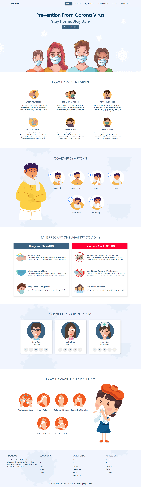

# COVID-19 Prevention Website

## Project Overview

This project is a responsive website built using HTML, CSS, and JavaScript to present important information about preventing the COVID-19 virus. The site uses modern web development techniques, including Flexbox and Grid layouts, to ensure that the design is adaptable to all screen sizes. Additionally, it features dropdown menus for smooth navigation on small screens, making the user experience seamless across devices.

## Features

- **Responsive Design** Ensures optimal viewing and interaction across a wide range of devices, from    large desktops (1440px) to small mobile screens (375px).
- **CSS Flexbox & Grid** Utilized for creating flexible and structured layouts, allowing elements to adjust gracefully to different screen sizes.
- **Interactive Carousel** Implements the Swiper library to display available cars in a smooth, touch-enabled slider.
- **Dynamic Dropdown Menus** Features dropdown navigation for easy access to different sections on mobile devices.
- **JavaScript Interactivity** Adds dynamic functionalities such as toggling menus, updating content based on user interactions, and more.

## Technologies Used

- **HTML5** Structuring the web content.
- **CSS3** Styling and implementing responsive design.
- **JavaScript** Adding interactivity and dynamic content manipulation.
- **CSS Flexbox & Grid** Designing flexible and responsive layouts.

## Live Demo 
[https://naglaa99.github.io/covid-website/]
